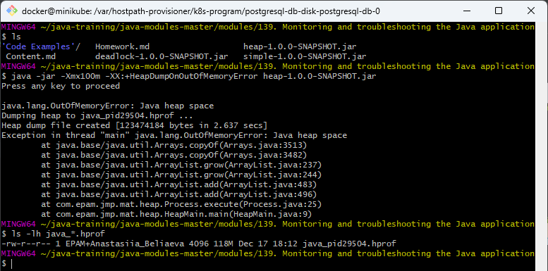
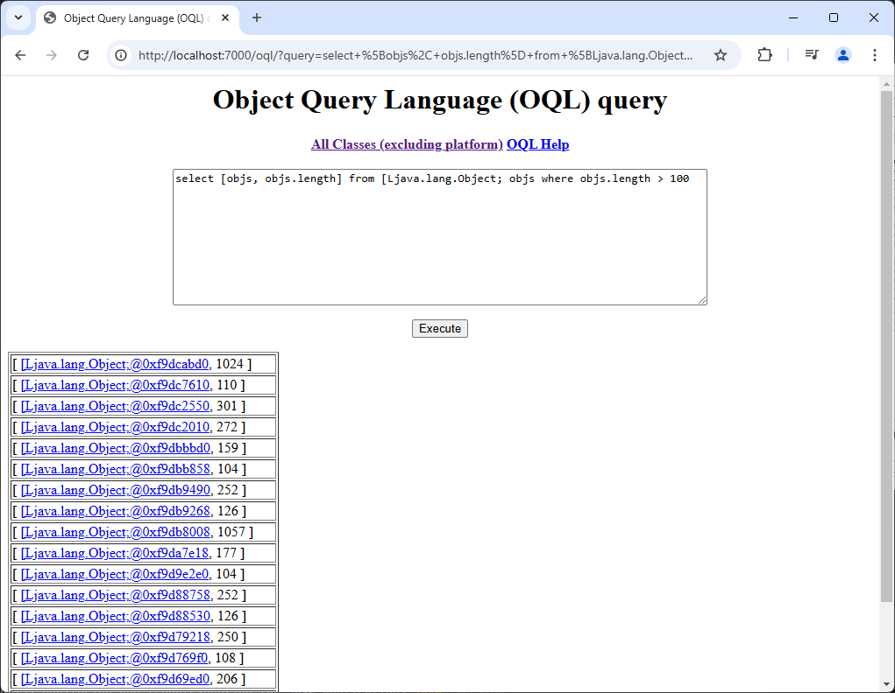

## Quiz

* Which interface JDK tools use to connect to JVM locally?\
Answer: the JVM tool interface (JVM TI)
* What is difference between profiling and traceability?\
Answer: profiling focuses on metrics, summaries and statistics, while tracing focuses on workflow, paths and events  


## OutOfMemory (OOM) error troubleshooting
#### Get OOM error
#### Use jvisualvm to observe OOM


#### Get heap dump
##### Using -XX:+HeapDumpOnOutOfMemoryError option


##### [Optional] Using jcmd
##### [Optional] Using jmap
#### Get heap histogram
##### Using jcmd
##### Using jmap


Last jcmd histograms before OOM


jmap histograms before OOM


#### Analyze heap dump
##### Using Java Visual VM
###### -XX:+HeapDumpOnOutOfMemoryError


###### jcmd


###### jmap


##### OQL
Execute OQL in jvisualvm:


Startup `jhat` (note: `jhat` was decommissioned in JDK 9)


Execute OQL in jhat



## Deadlock troubleshooting
#### Get deadlock
- Execute java application that simulates deadlock:


#### Get thread dump
1} jstack


2} kill -3

3} jvisualvm


4} Windows (Ctrl + Break)

5} jcmd


## Remote JVM profiling
Using [JMX Technology](https://docs.oracle.com/javase/8/docs/technotes/guides/management/agent.html)

For insecure remote connection use parameters:


Connect to JVM using jconsole:


## Inspect a Flight Recording
### Execute JVM with two special parameters:
```
    -XX:+UnlockCommercialFeatures
    -XX:+FlightRecorder
```


### Enable Flight Recording on JVM without these parameters:


### Open Java Mission Control and connect to default HotSpot of our JVM:

#### With -XX options: JMC before OOM


#### With -XX options: JMC after OOM 


#### With jcmd: JMC before OOM


#### With jcmd: JMC after OOM


## jinfo
Print system properties and command-line flags that were used to start the JVM.


